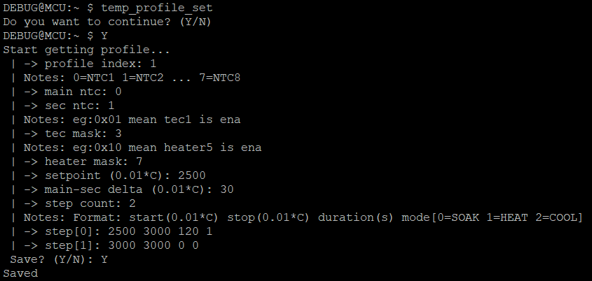

# Temperature Control Module

## Expected coverage

- **Temperature Profile Management** — Set, display, and validate temperature control profiles stored in database
- **Automatic Temperature Control** — Enable automatic mode and start temperature control process with PID-based regulation
- **PID Configuration** — Set and retrieve PID constants (Kp, Ki, Kd) for fine-tuning temperature control
- **Manual Mode** — Switch to manual temperature control mode for direct control
- **Data Logging** — Toggle temperature data logging to console for monitoring and debugging

## Core Temperature Control Commands

| Command | Arguments | Expected Response |
|---|---|---|
| `temp_profile_set` | profile_id | Profile get parameter from console |
| `temp_profile_diplay` | profile_id | Show of this profiles |
| `temp_profile_val` | none | Validation all profile with togetther |
| `temp_auto_ena` | profile_id | Automatic mode enabled, app begin preheat to hold on setpoint |
| `temp_auto_start` | profile_id | Temperature control started |
| `temp_auto_pid_set` | state_id kp ki kd | PID values confirmed |
| `temp_auto_pid_get` | state_id | Current PID constants |
| `temp_manu` | profile_id | Manual mode activated |
| `c` | none | ena/dis status log of profile 0 |

## Parameters

| Parameter | Range | Description |
|-----------|-------|-------------|
| `profile_id` | 0 – 7 | Profile ID in database |
| `state_id` | 1 – 8 | State ID in pid algorithm |
| `kp` | 0.0 – 100.0 | Proportional gain constant |
| `ki` | 0.0 – 100.0 | Integral gain constant |
| `kd` | 0.0 – 100.0 | Derivative gain constant |

## Temperature control mode

| Control Mode | Description |
|---|---|
| `Manual` | Direct manual temperature control |
| `Auto` | Automatic PID-based temperature control |

## Recommended Execution Flow

### 1. Profile Setup Phase

Step 1: Display available temperature profiles (optional)

```text
temp_profile_diplay 0
temp_profile_diplay 1
temp_profile_diplay 2
...
```

Step 2: Validate profile data integrity

```text
temp_profile_val
```

Step 3: Select active temperature profile (optional)

```text
temp_profile_set
```

Step 4: Confirm "Y" to continue or "N" to cancel (optional)

```text
Y
```

Step 5: Type all parameter in wizard (optional)



### 2. Automatic Control Configuration Phase

Step 6: Configure PID constants for control

```text
temp_auto_pid_set 1 1.5 0.8 0.3
```

Step 7: Enable automatic temperature control mode

```text
temp_auto_ena 0
```

### 3. Control Execution Phase

Step 8: Start automatic temperature control process

```text
temp_auto_start 0
```

### 4. Manual Mode Alternative (Optional)

Alternatively, switch to manual control mode:

```text
temp_manu 0
```